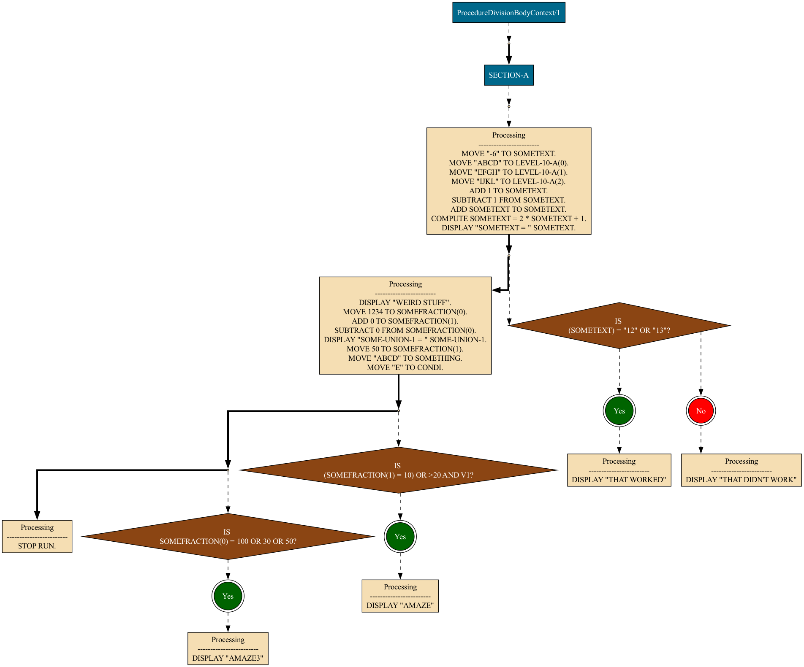
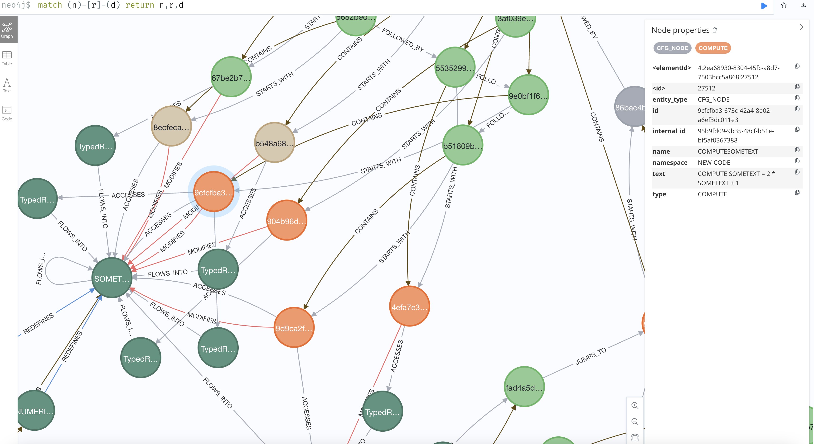
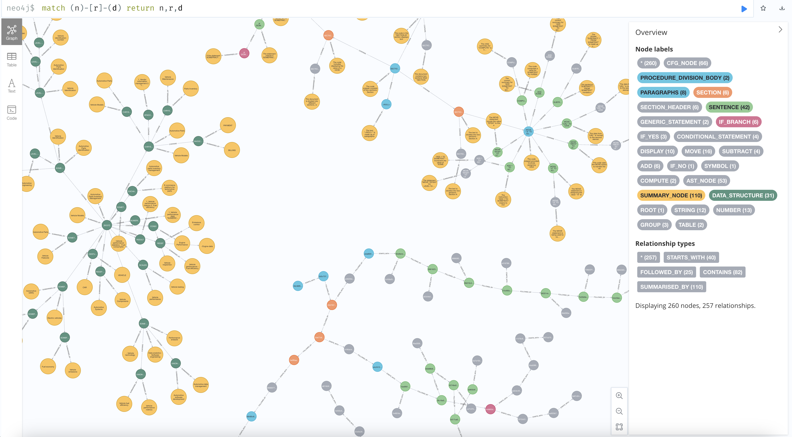
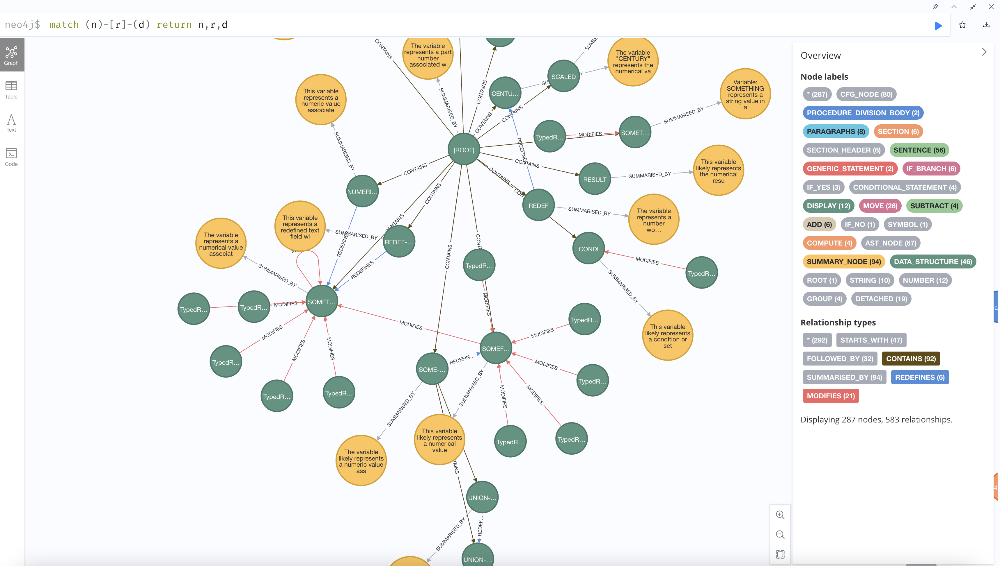
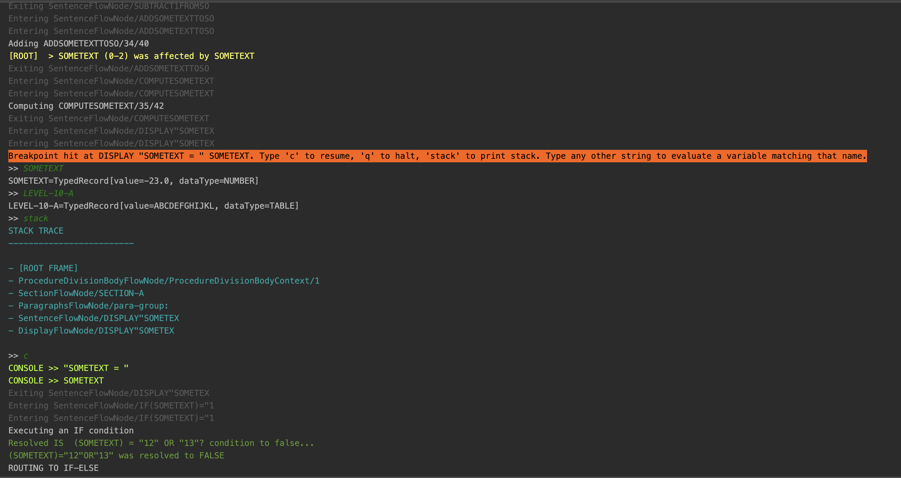

# Cobol REKT (Cobol Reverse Engineering KiT)

[](https://github.com/avishek-sen-gupta/cobol-rekt/actions/workflows/maven-publish.yml)

This is an evolving toolkit of capabilities helpful for reverse engineering legacy Cobol code. As of now, the following capabilities are available:

- Program / section / customisable node level flowchart generation based on AST
- Parse Tree generation (with export to JSON)
- Control Flow Tree generation
- The SMOJOL Interpreter (WIP)
- Injecting AST and Control Flow into Neo4J
- Injecting Cobol data layouts from Data Division into Neo4J (with dependencies)
- Injecting execution traces from the SMOJOL interpreter into Neo4J
- Injecting record dependency connections (MOVE, COMPUTE, etc.) into Neo4J
- Integration with OpenAI GPT to summarise nodes using bottom-up node traversal
- Exposes a unified model (AST, CFG, Data Structures with appropriate interconnections) which can be analysed through [JGraphT](https://jgrapht.org/) (which is embedded in the library)
- Support for namespaces to allow unique addressing of (possibly same) graphs
- Exporting ASTs, CFGs, and record dependencies to GraphML format

Cobol-REKT is more of a library of useful things intended to be embedded in more formal reverse engineering workflows/pipelines, rather than being a standalone tool (though you can certainly use it as such). Many of the higher-level wrappers are merely sensible defaults; you are encouraged to modify them to suit your needs.

## Dependencies

- The toolkit uses the grammar available in the [Eclipse Che4z Cobol Support project](https://github.com/eclipse-che4z/che-che4z-lsp-for-cobol) to create the parse tree.
- The toolkit uses the API from [Woof](https://github.com/asengupta/woof) to interact with Neo4J.

## Reverse Engineering Use Cases

Some reverse engineering are listed below. Descriptions of the capabilities which support these use cases are provided in later sections.

- The Parse Tree can be fed to a Graph DB for consumption by an LLM through agents to answer questions about the codebase
- Static analysis of the parse tree to reveal important operations (database operations, variable dependencies)
- The interpreter can be used to trace flows to experiment with different conditions
- Trace variable impact analysis (Which variables are affected by which in a particular run)
- Serve as input for LLM to explain specific flows in the program
- Serve as a proxy for testing behaviour at section/paragraph level if needed
- Identify dead code?
- Try out new rules?
- Identify different flows in the report - use cases for forward engineering

## Flowchart Generation

This capability allows the engineer to transform Cobol source (or part of it) into a flowchart. The flowchart stays true to the source but omits syntactic noise to produce a detailed flow of logic through the source. The capability uses Graphviz to generate the flowchart images.

### Example flowchart of the program test-exp.cbl


### Interpreting the Flowchart

The dotted lines indicate things that are inside a node. So, in the above example, after the first beige "Processing" block, there is a node which leads to an IF statement through the dotted line. What happens inside the IF statement can be understood by "stepping into" this dotted line. The normal flow after the IF statement finishes can be continued by returning to the node where the dotted line originates.

## Parse Tree Generation

This allows the engineer to produce the parse tree of Cobol source. This is suitable for use in further static analysis, transformation (into a control flow tree, for example), and inputs to other systems (informed chunking to an LLM, into a graph database for further exploration, etc.). See [Reverse Engineering Use Cases] for more examples.

Most of the capabilities are already present in the Che4z library. Some new grammars have been added. They are:

- IDMS panel definitions which are used in user interfaces
- Cobol Data Layouts, which are used in defining the records in the DATA DIVISION

## Control Flow Tree Generation

This capability allows the engineer to produce a control flow tree for the Cobol source. This can be used for straight-up visualisation (the flowchart capability actually uses the control flow tree behind the scenes), or more dynamic analysis through an interpreter. See [link](SMOJOL SMol Java-powered CobOL Interpreter) for a description of how this can help.

## Neo4J Integration

Both the AST and the Control Flow Graph can be injected directly into Neo4J. The AST injected can be in the same format as the SMOJOL interpreter, or the bare parse tree generated by ANTLR.
The Control Flow Graph is in the SMOJOL AST format.

When generating the AST and CFG, the library allows configuring them to be the same, i.e., the same nodes are reused for creating both AST and CFG connections. For example, in the screenshot below: the same CFG has ```CONTAINS``` (AST relationship), ```FOLLOWED_BY``` (CFG relationship), and the ```MODIFIES```/```ACCESSES``` relationships (data structure relationship).

This provides a rich unified view of the entire program, without having to jump between multiple disconnected views of the source code, for analysis.



## OpenAI integration

The OpenAI integration can be leveraged to summarise nodes in a bottom-up fashion (i.e., summarise leaf nodes first, then use those summaries to generate summarise the parent nodes, and so on).

The following diagram shows the AST, the Control Flow Graph, and the data structures graph. The yellow nodes are the summary nodes (generated through an LLM) attached to the AST (to provide explanations) and the data structures (to infer domains).



## Data Dependency Graph

This capability connects records which modify other records, with a ```FLOWS_INTO``` relation. The dependencies traced include variables which are used in expressions, as well as free-standing literals. Below is an example of a set of record dependencies from a program. It also generates connections based on REDEFINES clauses.



## SMOJOL (SMol Java-powered CobOL) Interpreter

The interpreter is a natural extension to building the parse tree for a Cobol source. Since syntax nodes are temporally ordered, it is possible to build an execution tree which covers all possible flows. This is the basis for flowchart generation, and also the basis for a tree-walk interpreter. The interpreter sets up the AST which is a projection of the parse tree more suitable for execution. Parts of the interpreter convert specific nodes in the AST into more suitable forms at runtime (for example, expression evaluation).

The primary motivation for the interpreter is to be able to simulate the execution of programs (or fragments of programs) in a sandboxed environment where the engineer needn't worry about fulfilling dependencies required to run the code in a true mainframe environment. Rather, they can inject these dependencies (values of variables, for example) as they see fit, to perform their true task: namely, performing control flow analysis.

The interpreter can run in two modes:

- **No-Operation mode:** In this mode, none of the processing statements like MOVE, ADD, etc. are actually executed, but control flow is still respected. This mode is useful in many contexts where the actual change in variables isn't as important as knowing / logging the action that is taking place. This is a good default starting point for ingesting runtime execution paths into a graph. Decisions which affect control flow are evaluated based on the kind of evaluation strategy specified, so the full expression evaluation strategy will not be effective. More specific strategies can be written, or interactive resolution through the console can be used.
- **Full evaluation mode (Experimental):** In this mode, expressions are actually evaluated to their final results, and is the closest to actual execution of the program including storing variable state. Note that this is a work in progress, since every nook and cranny of the Cobol standard is not supported yet.

## Current Capabilities of the Interpreter

- Support for most control constructs: IF/THEN, NEXT SENTENCE, GO TO, PERFORM, SEARCH...WHEN, IDMS ON
- Support for expression evaluation in COMPUTE, MOVE, ADD, SUBTRACT, MULTIPLY, DIVIDE
- Support for interactive resolution of conditions
- Most common class comparisons supported
- Support for abbreviated relation condition forms (IF A > 10 OR 20 AND 30...)
- Functioning type system (supports zoned decimals and alphanumerics) with a large subset of z/OS behaviour compatibility for scenarios undefined in the Cobol standard
- Support for fixed-size tables and single subscripting
- Support for elementary, composite, and recursive REDEFINES (REDEFINES of REDEFINES)
- Multiple subscript access
- Automatic detection of types from DATA DIVISION specifications
- Supports evaluation of level 88 variables
- Support for tracking variable state
- Set breakpoints based on conditions or specific AST node
- View current stack at a breakpoint
- View variable values at a breakpoint
- Support for different strategies to deal with unresolved record references (ignore / throw exception)
- Support for listeners to extract specific information about the current state of the program (all the Neo4J integrations are via these listeners)

## Planned Capabilities

- PERFORM VARYING
- PERFORM INLINE...VARYING
- Initialise values of variables from DATA DIVISION
- Support for floating point and alphabetic
- Support for REDEFINES larger than original record
- Variable snapshot per stack frame
- Evaluate IDMS expressions
- ON clauses on common operations
- ...

### Example interpreter session demonstrating breakpoints, stack traces, and record inspection


### Integration with Neo4J

The interpreter also supports injecting a complete execution path through the program into Neo4J. The screenshot below shows the execution trace of a reasonably complex program.


## GraphML Export
You can export to GraphML from Neo4J pretty easily. If you don't have Neo4J set up though, the toolkit allows exporting the following entities to the GraphML format (with all interconnections) as a single supergraph, so that they can be consumed further downstream for analysis:

- Abstract Syntax Tree
- Control Flow Graph
- Data Structures (and their dependencies)

The screenshot below shows a sample program's unified model exported to GraphML and loaded through the yEd Graph Editor.


To export the unified graph to GraphML from Neo4J, you can run the following command:

```
CALL apoc.export.graphml.all("<export.graphml>", {})
```

The file will be in the ```import``` directory inside the directory where the current database files are stored (in Neo4J Desktop).

## Analysis through JGraphT

In addition to writing to Neo4J and leveraging its data science capabilities to analyse the graph(s), the library also embeds [JGraphT](https://jgrapht.org/), a powerful library of graph algorithms. The ```JGraphTBuilder``` class converts the unified model (AST, CFG, Data Structures) into a DirectedPseudograph (because there can be both loops and parallel edges between two nodes), for consequent analysis through the JGraphT API.

Custom analyses are a work in progress.

## Analysis through Neo4J

You can find some useful Neo4J-based analysis queries in [Analysis](neo4j-analysis.md)

## How to Build

Run: ```mvn clean install```.

The Checkstyle step is only applicable for the Eclipse Cobol parser project. You can skip the Checkstyle targets with:

```mvn clean verify package -Dcheckstyle.skip=true```

You can skip the tests as well, using:

```mvn clean verify package -Dmaven.test.skip=true```

## How to Use

- See ```FlowChartBuildMain.java``` for examples of how flowcharts are created.
- See ```InterpreterMain.java``` for an example of how to run the interpreter on your code, as well as inject execution traces into Neo4J.
- See ```GraphExplorerMain.java``` for an example of how to inject ASTs, data structures, and CFGs into Neo4J.
- All the above examples also output the raw parse tree as a JSON file.
- CLI support is on the way.
- More detailed guides on programmatic use are on the way.

## Developer Guide

TODO...

## A Note on Copyright

This toolkit is distributed under the MIT License. However, the Eclipse Cobol Parser project is distributed under the Eclipse Public License V2. Accordingly, all modifications to the parser fall under the EPL v2 license, while the toolkit proper falls under the MIT License.

## Caveats

- This was built based on a time-boxed PoC, and thus isn't well-covered by tests yet. More are being added on an ongoing basis.
- Cobol is a large language, and thus the interpreter's capabilities are not exhaustive. However, the hope is that the subset currently present is useful enough to get started with reverse engineering legacy code. Obviously, more capabilities are being added on an ongoing basis.
- There are 4 superfluous directories at the top (engine, parser, dialect-daco, dialect-idms), which are a hack to get the Che4z Checkstyle targets to run because of a path configuration issue.

The rest of this file is mostly technical notes for my personal documentation.

## Valid Type Specifications for External Zoned Decimal and Alphanumeric

| Sym-1 / Sym-2     | S (Sign) | P (Left) | P (Right) | V (Decimal Point) | X (Alphanumeric) | 9 (Number) |
|-------------------|----------|----------|-----------|-------------------|------------------|------------|
| S (Sign)          | -        | X        | X         | X                 | -                | -          |
| P (Left)          | -        | X        | -         | X                 | -                | X          |
| P (Right)         | -        | -        | X         | -                 | -                | -          |
| V (Decimal Point) | -        | -        | X         | -                 | -                | X          |
| X (Alphanumeric)  | -        | -        | -         | -                 | X                | X          |
| 9 (Number)        | -        | -        | X         | X                 | X                | X          |


## Control Flow Notes

- Sentences which are GO TO need to not connect with the immediate next sentence in the code. The internal flow branches off correctly.

### Use the following command to build the Graphviz flowchart:

```dot -Kdot -v5 -Gsize=200,200\! -Goverlap=scale -Tpng -Gnslimit=4 -Gnslimit1=4 -Gmaxiter=2000 -Gsplines=line dotfile.dot -oflowchart-level5.png```

These are some other commands tried on larger graphs:
- ```dot -Kneato -v5 -Tpng dotfile.dot -oflowchart-level5.png```
- ```dot -Kdot -v5 -Gsize=200,200\! -Goverlap=scale -Tpng -Gnslimit=2 -Gnslimit1=2 -Gmaxiter=2000 -Gsplines=line dotfile.dot -oflowchart-level5.png```
- ```dot -Kfdp -v5 -Goverlap=scale -Gsize=200,200\! -Tpng  dotfile.dot -oflowchart-level5.png```
- ```dot -Ktwopi -v5 -Gsize=200,200\! -Tpng  dotfile.dot -oflowchart-level5.png```

### This prints out all levels

```dot -Kdot -v5 -Gsize=200,200\! -Goverlap=scale -Tpng -Gnslimit=4 -Gnslimit1=4 -Gmaxiter=2000 -Gsplines=line dotfile.dot -oflowchart-level5.png```

