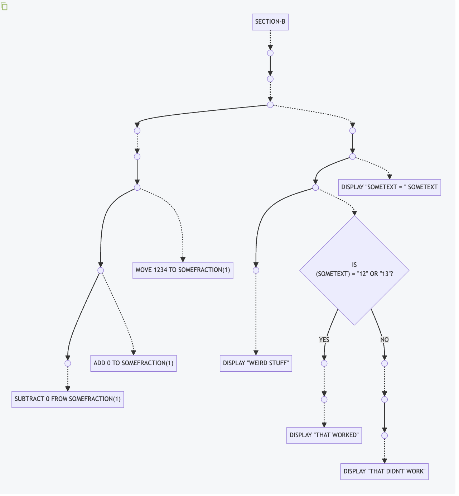
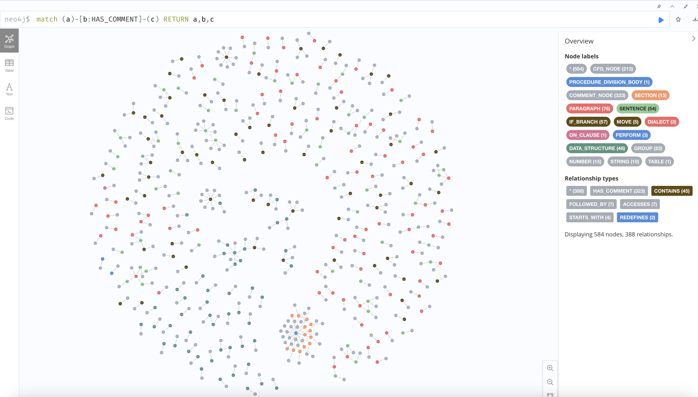
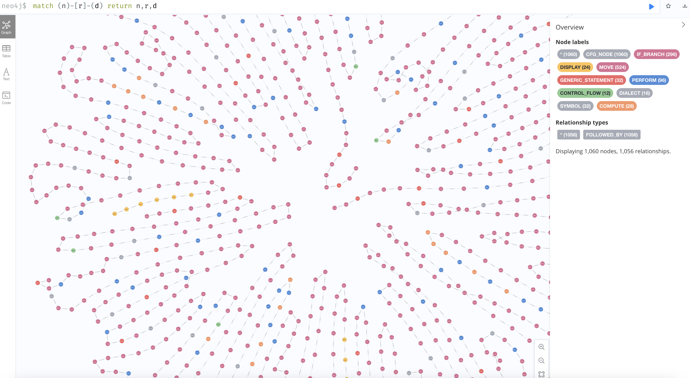
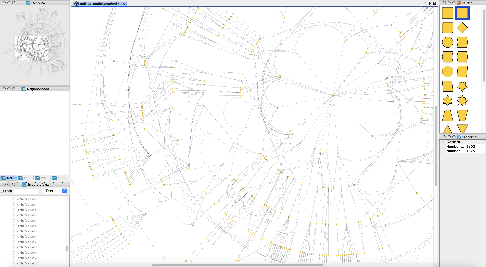
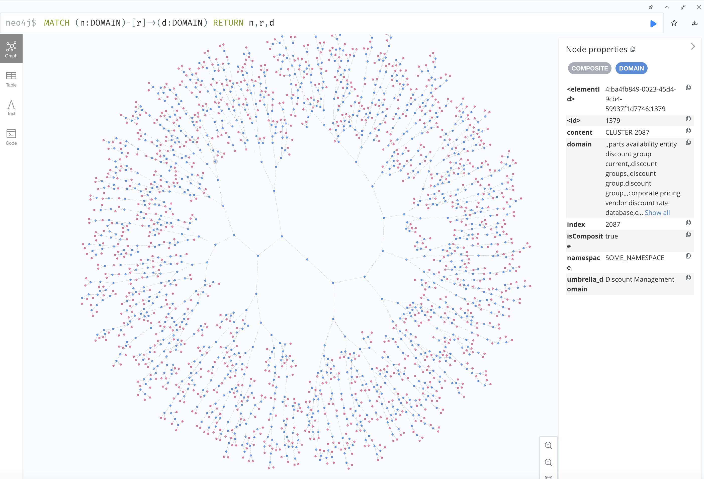
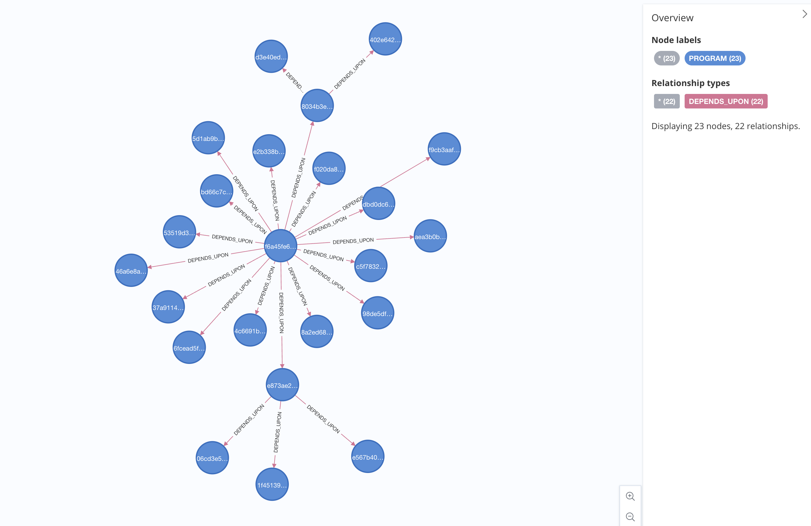

# Cobol-REKT (Cobol Reverse Engineering KiT)

[](https://github.com/avishek-sen-gupta/cobol-rekt/actions/workflows/maven-publish.yml)

This is an evolving toolkit of capabilities helpful for reverse engineering legacy Cobol code. As of now, the following capabilities are available:

- Program / section / paragraph level flowchart generation based on AST (SVG or PNG)
- Section-wise generation of Mermaid flowcharts
- Parse Tree generation (with export to JSON)
- Control Flow Tree generation (with export to JSON)
- Allows embedding code comments as comment nodes in the graph
- The SMOJOL Interpreter (WIP)
- Injecting AST and Control Flow into Neo4J
- Injecting Cobol data layouts from Data Division into Neo4J (with dependencies like MOVE, COMPUTE, etc.) + export to JSON
- Injecting execution traces from the SMOJOL interpreter into Neo4J
- Perform actions on graphs using depth first traversals in Neo4J (AST nodes or Data Structure nodes). Use cases can include aggregating lower-level summaries (using an LLM) into more abstract descriptions of functionality, a la GraphRAG.
- Exposes a unified model (AST, CFG, Data Structures with appropriate interconnections) which can be analysed through [JGraphT](https://jgrapht.org/), together with export to GraphML format and JSON.
- Support for namespaces to allow unique addressing of (possibly same) graphs
- Analysing static value assignments to variables
- **ALPHA:** Support for building Glossary of Variables from data structures using LLMs
- **ALPHA:** Support for extracting Capability Graph from paragraphs of a program using LLMs
- **ALPHA:** Injecting inter-program dependencies into Neo4J (with export to JSON)
- **ALPHA:** Paragraph similarity map (Java / Python)
- **ALPHA:** Code Pattern Detection (Neo4J / NetworkX)

Cobol-REKT is more of a library of useful things intended to be embedded in more formal reverse engineering workflows/pipelines, rather than being a standalone tool (though you can certainly use it as such). Many of the higher-level wrappers are merely sensible defaults; you are encouraged to modify them to suit your needs.

**It is also to be noted that OpenAI integration is only attached to specific features. Much of the functionality of this toolkit is based on deterministic analysis.**

The toolkit consists of Java components, most of which are around parsing, ingestion of, and export from Cobol sources, and Python components, which carry out the analyses. In addition, the support for Neo4J allows you to build custom graph analyses as per your needs. I expect most of the analysis to happen through Python (using Neo4J or NetworkX), hence the Java component tries to unlock as much of the ingested data as possible in different formats.

**If you are trying out Cobol-REKT in your project, I'd love to know and feature it in the README (simply open a PR, and we can go from there)! I'm also welcoming contributors, and/or feature requests for your use cases.**

You can see the current backlog [here](https://github.com/users/avishek-sen-gupta/projects/1.).

## Major Dependencies

- The toolkit uses the grammar available in the [Eclipse Che4z Cobol Support project](https://github.com/eclipse-che4z/che-che4z-lsp-for-cobol) to create the parse tree.
- The toolkit uses the API from [Woof](https://github.com/asengupta/woof) to interact with Neo4J.
- [Graphviz](https://graphviz.org/) for flowchart generation; see its documentation for OS-specific installation instructions.
- [JGraphT](https://jgrapht.org/) for Java-based graph analyses and some export functionality.
- [NetworkX](https://networkx.org/) for Python-based graph analyses
- An implementation of the gSpan algorithm for Frequent Subgraph Mining is adapted from [https://github.com/betterenvi/gSpan].
- [Neo4J](https://neo4j.com/) is required for using tasks involving Neo4J. The APOC and GDS plugins will need to be installed. All the tasks have also been tested using Neo4J Desktop.
- A subscription to OpenAI's GPT-4o (or your choice of deployment) will be needed for capabilities which use LLMs. The tasks have been tested using Azure's OpenAI offering.

## Reverse Engineering Use Cases

Some reverse engineering use cases are listed below. Descriptions of the capabilities which support these use cases are provided in later sections.

- The Parse Tree can be fed to a Graph DB for consumption by an LLM through agents to answer questions about the codebase
- Static analysis of the parse tree to reveal important operations (database operations, variable dependencies)
- The interpreter can be used to trace flows to experiment with different conditions
- Trace variable impact analysis (Which variables are affected by which in a particular run)
- Serve as input for LLM to explain specific flows in the program
- Serve as a proxy for testing behaviour at section/paragraph level if needed
- Identify dead code?
- Try out new rules?
- Identify different flows in the report - use cases for forward engineering

## Work in Progress

- Graph Edit distance between paragraphs through NetworkX
- Clone Detection
- Common Pattern Detection with Configurable Code Patterns
- CICS support

## Planned Capabilities and/or Experiments

- Integrating Domain Knowledge
- IDMS Identify UI interactions and participants (```INSPECT```, ```MAP IN```, ```INQUIRE MAP```, Panel Definition parsing)
- Quad Generation (WIP): This is a WIP experiment to generate Instruction Quads (a sort of language-independent Intermediate Representation described in the Dragon Book (Compilers: Principles, Techniques, and Tools by Aho, Sethi, Ullman).

## Flowchart Generation

This capability allows the engineer to transform Cobol source (or part of it) into a flowchart. The flowchart stays true to the source but omits syntactic noise to produce a detailed flow of logic through the source. The capability uses Graphviz to generate the flowchart images. The flowchart can be generated by specifying the ```DRAW_FLOWCHART``` task.

- Specifying the ```--generation``` parameter as ```SECTION``` creates one flowchart per section, while specifying the value as ```PROGRAM``` generates one flowchart for the entire program.
- You can specify the output format as SVG or PNG by setting ```--fileOutputFormat``` to ```SVG``` or ```PNG``` respectively.

### Example flowchart of the program test-exp.cbl


### Interpreting the Flowchart

The dotted lines indicate things that are inside a node. So, in the above example, after the first beige "Processing" block, there is a node which leads to an IF statement through the dotted line. What happens inside the IF statement can be understood by "stepping into" this dotted line. The normal flow after the IF statement finishes can be continued by returning to the node where the dotted line originates.

You can also generate Mermaid flowcharts for embedding in other Markdown files. You can use the ```EXPORT_MERMAID``` task for this. Currently, this supports only section-wise generation of Mermaid charts.



## Parse Tree Generation

This allows the engineer to produce the parse tree of Cobol source. This is suitable for use in further static analysis, transformation (into a control flow tree, for example), and inputs to other systems (informed chunking to an LLM, into a graph database for further exploration, etc.). See [Reverse Engineering Use Cases](#reverse-engineering-use-cases) for more examples.

Most of the capabilities are already present in the Che4z library. Some new grammars have been added. They are:

- IDMS panel definitions which are used in user interfaces
- Cobol Data Layouts, which are used in defining the records in the DATA DIVISION

This capability can be used by specifiying the ```WRITE_RAW_AST``` task.

## Control Flow Tree Generation

This capability allows the engineer to produce a control flow tree for the Cobol source. This can be used for straight-up visualisation (the flowchart capability actually uses the control flow tree behind the scenes), or more dynamic analysis through an interpreter. See [SMOJOL (SMol Java-powered CobOL Interpreter)](#smojol-smol-java-powered-cobol-interpreter) for a description of how this can help.

The CFG generation is part of the ```INJECT_INTO_NEO4J``` task.

## Neo4J Integration

Both the AST and the Control Flow Graph can be injected directly into Neo4J. The AST injected can be in the same format as the SMOJOL interpreter, or the bare parse tree generated by ANTLR.
The Control Flow Graph is in the SMOJOL AST format.

When generating the AST and CFG, the library allows configuring them to be the same, i.e., the same nodes are reused for creating both AST and CFG connections. For example, in the screenshot below: the same CFG has ```CONTAINS``` (AST relationship), ```FOLLOWED_BY``` (CFG relationship), and the ```MODIFIES```/```ACCESSES``` relationships (data structure relationship).

This provides a rich unified view of the entire program, without having to jump between multiple disconnected views of the source code, for analysis.

This can be done by specifiying the ```INJECT_INTO)NEO4J``` task.


## OpenAI integration

The OpenAI integration can be leveraged to summarise nodes in a bottom-up fashion (i.e., summarise leaf nodes first, then use those summaries to generate summarise the parent nodes, and so on).

The following diagram shows the AST, the Control Flow Graph, and the data structures graph. The yellow nodes are the summary nodes (generated through an LLM) attached to the AST (to provide explanations) and the data structures (to infer domains).


## Data Dependency Graph

This capability connects records which modify other records, with a ```FLOWS_INTO``` relation. The dependencies traced include variables which are used in expressions, as well as free-standing literals. Below is an example of a set of record dependencies from a program. It also generates connections based on REDEFINES clauses.


## Comments Integration

This capability connects comments to the nearest subsequent node, with a ```HAS_COMMENT``` connection. This works for comments in the PROCEDURE division and all data structures. Comments before copybooks are connected to the main program node. Any comments which cannot be attached to found nodes, end up being connected to the main program node.

This can be done by specifying the ```ATTACH_COMMENTS``` task. Note that for the comment nodes to appear in the graph, the ```INJECT_INTO_NEO4J``` task must appear after the ```ATTACH_COMMENTS``` task.

The example below shows all node-comment sets for a reasonably large program.



## SMOJOL (SMol Java-powered CobOL) Interpreter

The interpreter is a natural extension to building the parse tree for a Cobol source. Since syntax nodes are temporally ordered, it is possible to build an execution tree which covers all possible flows. This is the basis for flowchart generation, and also the basis for a tree-walk interpreter. The interpreter sets up the AST which is a projection of the parse tree more suitable for execution. Parts of the interpreter convert specific nodes in the AST into more suitable forms at runtime (for example, expression evaluation).

The primary motivation for the interpreter is to be able to simulate the execution of programs (or fragments of programs) in a sandboxed environment where the engineer needn't worry about fulfilling dependencies required to run the code in a true mainframe environment. Rather, they can inject these dependencies (values of variables, for example) as they see fit, to perform their true task: namely, performing control flow analysis.

The interpreter can run in two modes:

- **No-Operation mode:** In this mode, none of the processing statements like MOVE, ADD, etc. are actually executed, but control flow is still respected. This mode is useful in many contexts where the actual change in variables isn't as important as knowing / logging the action that is taking place. This is a good default starting point for ingesting runtime execution paths into a graph. Decisions which affect control flow are evaluated based on the kind of evaluation strategy specified, so the full expression evaluation strategy will not be effective. More specific strategies can be written, or interactive resolution through the console can be used.
- **Full evaluation mode (Experimental):** In this mode, expressions are actually evaluated to their final results, and is the closest to actual execution of the program including storing variable state. Note that this is a work in progress, since every nook and cranny of the Cobol standard is not supported yet.

## Current Capabilities of the Interpreter

- Support for most control constructs: IF/THEN, NEXT SENTENCE, GO TO, PERFORM, SEARCH...WHEN, IDMS ON
- Support for expression evaluation in COMPUTE, MOVE, ADD, SUBTRACT, MULTIPLY, DIVIDE
- Support for interactive resolution of conditions
- Most common class comparisons supported
- Support for abbreviated relation condition forms (IF A > 10 OR 20 AND 30...)
- Functioning type system (supports zoned decimals and alphanumerics) with a large subset of z/OS behaviour compatibility for scenarios undefined in the Cobol standard
- Support for fixed-size tables and single subscripting
- Support for elementary, composite, and recursive REDEFINES (REDEFINES of REDEFINES)
- Multiple subscript access
- Automatic detection of types from DATA DIVISION specifications
- Supports evaluation of level 88 variables
- Support for tracking variable state
- Set breakpoints based on conditions or specific AST node
- View current stack at a breakpoint
- View variable values at a breakpoint
- Support for different strategies to deal with unresolved record references (ignore / throw exception)
- Support for listeners to extract specific information about the current state of the program (all the Neo4J integrations are via these listeners)

## Planned Capabilities

- Support symbolic execution
- Support EVALUATE statements
- Handle GIVING phrases in ADD/SUBTRACT/MULTIPLY/DIVIDE
- PERFORM VARYING
- PERFORM INLINE...VARYING
- Initialise values of variables from DATA DIVISION
- Support for floating point and alphabetic
- Support for REDEFINES larger than original record
- Variable snapshot per stack frame
- Evaluate IDMS expressions
- ON clauses on common operations
- ...

### Example interpreter session demonstrating breakpoints, stack traces, and record inspection


### Integration with Neo4J

The interpreter also supports injecting a complete execution path through the program into Neo4J. The screenshot below shows the execution trace of a reasonably complex program.



## GraphML Export
You can export to GraphML from Neo4J pretty easily. If you don't have Neo4J set up though, the toolkit allows exporting the following entities to the GraphML format (with all interconnections) as a single supergraph, so that they can be consumed further downstream for analysis:

- Abstract Syntax Tree (the ```WRITE_FLOW_AST``` task)
- Control Flow Graph (the ```WRITE_CFG``` task)
- Data Structures + Dependencies (included under both of the above tasks)

The screenshot below shows a sample program's unified model exported to GraphML and loaded through the yEd Graph Editor.



To export the unified graph to GraphML from Neo4J, you can run the following command:

```
CALL apoc.export.graphml.all("<export.graphml>", {})
```

The file will be in the ```import``` directory inside the directory where the current database files are stored (in Neo4J Desktop).

## Analysis through JGraphT

In addition to writing to Neo4J and leveraging its data science capabilities to analyse the graph(s), the library also embeds [JGraphT](https://jgrapht.org/), a powerful library of graph algorithms. The ```JGraphTBuilder``` class converts the unified model (AST, CFG, Data Structures) into a DirectedPseudograph (because there can be both loops and parallel edges between two nodes), for consequent analysis through the JGraphT API.

Custom analyses are a work in progress. The ```COMPARE_CODE``` task, for example, uses the JGraphT library.

## Useful Analyses through plain Python

### 1) Analyse static value assignments to variables

This is useful for when you are looking for the range of values which are assigned to a record in a program. You will need to execute the ```WRITE_RAW_AST``` task first, like so:

```
java -jar smojol-cli/target/smojol-cli.jar run test-exp.cbl hello.cbl --commands="WRITE_RAW_AST" --srcDir /Users/asgupta/code/smojol/smojol-test-code --copyBooksDir /Users/asgupta/code/smojol/smojol-test-code --dialectJarPath ./che-che4z-lsp-for-cobol-integration/server/dialect-idms/target/dialect-idms.jar --reportDir out/report --generation=PROGRAM
```

Once you have the AST file, you can run the analysis like so (making sure first that you are in the ```smojol_python``` directory):

```
python -m src.analysis.variable_static_values /path/to/ast/json --output=/path/to/output
```

If you omit the ```--output``` flag, it will simply print out the results.

## Analysis through NetworkX

If you export the Unified Model to JSON, you can import it into NetworkX quite easily. The ```unified_model_to_networkx``` script lets you ingest the JSON and create both the fully-connected NetworkX graph, as well as the in-memory Python equivalent of the Unified Model. You're free to extract out specific parts of the model through convenience functions. The following code extracts out the AST, CFG, and the data structures separately. You can customise extraction for your use case; take a look at any one of those convenience methods for guidance.

```
with open(input_path, 'r') as file:
    unified = json.load(file)
    ast_x, _, _ = extract_ast(unified)
    cfg_x, _, _ = extract_cfg(unified)
    ds_x, _, _ = extract_ds(unified)
```

There are currently two tasks implemented using NetworkX.

### Code Similarity

TODO...
See ```similarity.py```.

### Code Pattern Recognition

It is very easy to do pattern matching in Neo4J, so you might choose to use those facilities instead (see [Analysis through Neo4J](#analysis-through-neo4j)). However, pattern matching is also possible using NetworkX directly using subgraph isomorphisms.

You will need to construct the subgraph pattern through code, which is not as elegant as writing Cypher queries, but it does work. See ```pattern_matcher.py``` for an example.

## Analysis through Neo4J

### Code Pattern Recognition

You can match patterns pretty easily through Cypher. See ```neo4j_pattern_matcher.py``` for an example of how to match a call pattern, i.e., a bunch of sequential ```MOVE``` statements, followed by a ```CALL``` statement. The patterns being developed are documented in ```neo4j_pattern_queries.py```.


You can find some useful Neo4J-based analysis queries in [Analysis](neo4j-analysis.md)

## Building Glossaries **(ALPHA)**

The toolkit supports building glossaries of variables given the data structures in a program. This capability is provided through Python in the ```smojol_python``` component.
To use this facility, start by exporting the data structures to JSON, through the JAR, like so:

```
java -jar smojol-cli/target/smojol-cli.jar run YOUR_PROGRAM --commands="WRITE_DATA_STRUCTURES" --srcDir /path/to/sources --copyBooksDir /path/to/copybooks --dialectJarPath che-che4z-lsp-for-cobol-integration/server/dialect-idms/target/dialect-idms.jar --dialect IDMS --reportDir /path/to/report/dir
```

This will generate a JSON file in ```/path/to/report/dir```. After this, you can run:

```
cd smojol_python
python -m src.llm.glossary_builder.main /path/to/report/dir/program-data.json out/glossary.md
```

This will generate the glossary in ```out/glossary.md```. Integrating other out-of-band data sources is a work in progress.

## Build Capability Maps **(ALPHA)**

The toolkit supports extracting a capability map from the paragraphs of a source. For this, you need to generate both the AST in Neo4J, as well as the data structures JSON, you can do this via:

```
java -jar smojol-cli/target/smojol-cli.jar run YOUR_PROGRAM --commands="INJECT_INTO_NEO4J WRITE_DATA_STRUCTURES" --srcDir /path/to/sources --copyBooksDir /path/to/copybooks --dialectJarPath che-che4z-lsp-for-cobol-integration/server/dialect-idms/target/dialect-idms.jar --dialect IDMS --reportDir /path/to/report/dir
```
After this, you will want to extract the paragraph capabilities, like so:

```
python -m src.llm.capability_extractor.paragraph_capabilities /path/to/data/structures/json /paragraph/capabilities/output/path ../paragraph/variables/explanation/output/path
```

This will generate the capabilities in ```/paragraph/capabilities/output/path```. At this point, you may need to clean parts of the output manually, if some entries do not correpond to a comma-separated list of domain terms (efforts to eliminate this manual process are in progress).

The final step is to actually generate the capability map:

```
python -m src.llm.capability_extractor.capabilities_graph /paragraph/capabilities/output/path
```


This will take a little time, depending upon the number of paragraphs and their sizes. At the end, it will generate a dendrogram visualisation, as will as the capability map in Neo4J, as illustrated below (for a 10000+ line COBOL program).




## How to Build

The toolkit uses JDK 21 features; so you'll need the appropriate JDK set up.

Run: ```mvn clean install```.

The Checkstyle step is only applicable for the Eclipse Cobol parser project. You can skip the Checkstyle targets with:

```mvn clean verify package -Dcheckstyle.skip=true```

You can skip the tests as well, using:

```mvn clean verify package -Dmaven.test.skip=true```

For generating flowcharts, you will need to set up Graphviz on your box; see the [site](https://graphviz.org/) for OS-specific installation instructions.

Before using any of the Python components, you will need to install dependencies, like so:

```
cd smojol_python
pip install -r requirements.txt
```

## Running against AWS Card Demo

The library has been tested (validation, flowchart generation, AST generation, Unified Model generation) against the [AWS Card Demo](https://github.com/aws-samples/aws-mainframe-modernization-carddemo) codebase. To run it against that codebase, do the following:

- Clone the repository
- Create an empty file ```app/cpy/DFHAID```
- Create an empty file ```app/cpy/DFHBMSCA```

Now run your commands as usual.

## Developer Guide

### CLI Usage
The individual functionalities in the Java component can be invoked using different commands. Further tasks / commands will be added.

#### Command: ```run```

This command encapsulates almost all the tasks that you are likely to run. The descriptions of the various commands are listed below.

- ```WRITE_FLOW_AST```: Writes a more useful form of the AST to JSON. This form is used by the interpreter and other analyses.
- ```INJECT_INTO_NEO4J```: This injects the unified model into Neo4J. Exposing more fine-grained options is in progress. This requires the environment variable ```NEO4J_URI```, ```NEO4J_USERNAME```, and ```NEO4J_PASSWORD``` to be defined. If you wish to include comments in the graph, the ```ATTACH_COMMENTS``` needs to have run first.
- ```ATTACH_COMMENTS```: This parses the original source file (excluding copybooks for now) to find comments and attach them to the nearest subsequent AST node.
- ```EXPORT_TO_GRAPHML```: This exports the unified model to GraphML. Exposing more fine-grained options is in progress.
- ```WRITE_RAW_AST```: This writes the original parse tree to JSON. Useful for downstream code to build their own AST representations.
- ```DRAW_FLOWCHART```: This outputs flowcharts for the whole program or section-by-section of the program in PNG format.
- ```EXPORT_MERMAID```: This outputs section-wise (one file per section) flowcharts for the program in the Mermaid format.
- ```WRITE_CFG```: This outputs the control flow graph of the program as JSON.
- ```WRITE_DATA_STRUCTURES```: This exports the data structure hierarchy of the program as JSON.
- ```BUILD_PROGRAM_DEPENDENCIES``` (ALPHA): Builds direct program dependencies from ```CALL``` and IDMS ```TRANSFER CONTROL``` statements. Indirect dependencies are not traced. For tracing the full dependency graph, see the ```dependency``` task.
- ```COMPARE_CODE``` (ALPHA): Builds a map of inter-paragraph similarity based on node edit distances (using the Zhang-Shasha algorithm). Work in Progress.

For example, if you wanted to run all of the above, you could run the following command:

```
java -jar smojol-cli/target/smojol-cli.jar run test-exp.cbl hello.cbl --commands="WRITE_FLOW_AST INJECT_INTO_NEO4J EXPORT_TO_GRAPHML WRITE_RAW_AST DRAW_FLOWCHART WRITE_CFG" --srcDir /Users/asgupta/code/smojol/smojol-test-code --copyBooksDir /Users/asgupta/code/smojol/smojol-test-code --dialectJarPath ./che-che4z-lsp-for-cobol-integration/server/dialect-idms/target/dialect-idms.jar --reportDir out/report --generation=PROGRAM
```

Passing the validation flag (```--validate``` or ```-v```) skips running all tasks, and simply validates whether the source is syntactically correct. This is non-strict validation, i.e., invalid variable references are reported, but do not cause failure.

Specifying the ```--permissiveSearch``` flag matches file names more permissively, i.e., case-insensitive matching, and optional matching of files with ```.cbl``` extensions.

The help text is reproduced below (obtained by adding ```--help```):

```
Usage: app run [-hpvV] [-d=<dialect>] [-dp=<dialectJarPath>]
               [-f=<flowchartOutputFormat>] [-g=<flowchartGenerationStrategy>]
               -r=<reportRootDir> -s=<sourceDir> -c=<commands>
               [-c=<commands>]... -cp=<copyBookDirs>[,<copyBookDirs>...]
               [-cp=<copyBookDirs>[,<copyBookDirs>...]]... [<programNames>...]
Implements various operations useful for reverse engineering Cobol code
      [<programNames>...]    The programs to analyse
  -c, --commands=<commands>  The commands to run (INJECT_INTO_NEO4J,
                               EXPORT_TO_GRAPHML, WRITE_RAW_AST,
                               DRAW_FLOWCHART, WRITE_FLOW_AST, WRITE_CFG,
                               ATTACH_COMMENTS, WRITE_DATA_STRUCTURES,
                               BUILD_PROGRAM_DEPENDENCIES, COMPARE_CODE,
                               EXPORT_UNIFIED_TO_JSON, EXPORT_MERMAID)
      -cp, --copyBooksDir=<copyBookDirs>[,<copyBookDirs>...]
                             Copybook directories (repeatable)
  -d, --dialect=<dialect>    The COBOL dialect (COBOL, IDMS)
      -dp, --dialectJarPath=<dialectJarPath>
                             Path to dialect .JAR
  -f, --flowchartOutputFormat=<flowchartOutputFormat>
                             Format of the flowchart output (PNG, SVG)
  -g, --generation=<flowchartGenerationStrategy>
                             The flowchart generation strategy. Valid values
                               are SECTION, PROGRAM, and NODRAW
  -h, --help                 Show this help message and exit.
  -p, --permissiveSearch     Match filename using looser criteria
  -r, --reportDir=<reportRootDir>
                             Output report directory
  -s, --srcDir=<sourceDir>   The Cobol source directory
  -v, --validate             Only run syntax validation on the input
  -V, --version              Print version information and exit.
```

#### Command: ```dependency``` (WIP)

This command is used to trace the inter-program dependencies starting from a root program. To run this, use something like:

```
java -jar smojol-cli/target/smojol-cli.jar dependency if-test.cbl --srcDir /Users/asgupta/code/smojol/smojol-test-code --copyBooksDir /Users/asgupta/code/smojol/smojol-test-code --dialectJarPath ./che-che4z-lsp-for-cobol-integration/server/dialect-idms/target/dialect-idms.jar --export=out.json
```

Specifying the ```--neo4j``` flag injects those dependencies into Neo4J, while setting a path through ```export``` will export it to JSON. The screenshot below shows a very simple dependency graph generated from ```if-test.cbl``` (in the ```smojol-test-code``` directory). Dynamic dependencies (resolved through variables and expressions) are resolved in a very simple heuristic fashion for now; the code looks back upto 5 instructions before the control flow statement to see if there are any literal assignments to the variable holding the call target. If it finds one, that literal value is used.



The help text for this command is reproduced below:

```
Usage: app dependency [-hnpV] [-d=<dialect>] [-dp=<dialectJarPath>]
                      -s=<sourceDir> [-x=<exportPath>] -cp=<copyBookDirs>[,
                      <copyBookDirs>...] [-cp=<copyBookDirs>[,
                      <copyBookDirs>...]]... <programName>
Implements various operations useful for reverse engineering Cobol code
      <programName>          The program to analyse
      -cp, --copyBooksDir=<copyBookDirs>[,<copyBookDirs>...]
                             Copybook directories (repeatable)
  -d, --dialect=<dialect>    The COBOL dialect (COBOL, IDMS)
      -dp, --dialectJarPath=<dialectJarPath>
                             Path to dialect .JAR
  -h, --help                 Show this help message and exit.
  -n, --neo4j                Export to Neo4J
  -p, --permissiveSearch     Match filename using looser criteria
  -s, --srcDir=<sourceDir>   The Cobol source directory
  -V, --version              Print version information and exit.
  -x, --export=<exportPath>  Export path
```

#### Command: ```validate```
As an alternative to using the ```--validate``` flag, you can use the ```validate``` command explicitly, like so:

```
java -jar smojol-cli/target/smojol-cli.jar validate minimum.cbl test-exp.cbl --srcDir smojol-test-code/ --copyBooksDir "/path/1/copybooks,/path/1/copybooks" --dialectJarPath che-che4z-lsp-for-cobol-integration/server/dialect-idms/target/dialect-idms.jar --dialect IDMS --output out/validation.json
```

If you specify a path to ```output```, the results will be written to the corresponding file as JSON.

By default, this is non-strict validation, i.e., invalid variable references are reported, but do not cause failure. If the ```--strict``` flag is also specified, invalid variable references in the program will cause the task to fail.

The help text is reproduced below:

```
Usage: app validate [-hptV] [-d=<dialect>] [-dp=<dialectJarPath>]
                    [-o=<outputPath>] -s=<sourceDir> -cp=<copyBookDirs>[,
                    <copyBookDirs>...] [-cp=<copyBookDirs>[,
                    <copyBookDirs>...]]... [<programNames>...]
Validates the candidate COBOL code
      [<programNames>...]    The programs to analyse
      -cp, --copyBooksDir=<copyBookDirs>[,<copyBookDirs>...]
                             Copybook directories (repeatable)
  -d, --dialect=<dialect>    The COBOL dialect (COBOL, IDMS)
      -dp, --dialectJarPath=<dialectJarPath>
                             Path to dialect .JAR
  -h, --help                 Show this help message and exit.
  -o, --output=<outputPath>  Validation results output path
  -p, --permissiveSearch     Match filename using looser criteria
  -s, --srcDir=<sourceDir>   The Cobol source directory
  -t, --strict               Force strict validation, verify all variable
                               usages are valid
  -V, --version              Print version information and exit.
```

### Programmatic Usage

**NOTE: The API is under active development, and may be subject to change.**

The simplest way to invoke tasks associated with the ```CodeTaskRunner``` through the API is using ```CodeTaskRunner```, like so:

```
        CodeTaskRunner codeTaskRunner1 = new CodeTaskRunner("/path/to/src",
                "/path/to/report",
                ImmutableList.of(new File("/path/1/to/cpy"),
                        new File("/path/2/to/cpy"),
                        new File("/path/3/to/cpy")),
                "/path/to/dialect-idms.jar",
                LanguageDialect.IDMS, new FullProgram(PNG), new UUIDProvider(), new OccursIgnoringFormat1DataStructureBuilder(), new ProgramSearch());

```

Depending upon the number of tasks invoked, the result will contain a list of ```AnalysisTaskResult``` objects, which can be either ```AnalysisTaskResultOK``` or ```AnalysisTaskResultError```. You can use them to determine what you want to do.

This invocation uses some specific conventions when deciding where to output file artifacts under the ```report-dir``` directory.
If you want more fine-grained control of the location of output artifacts, you can use the ```SmojolTasks``` class, which gives you more configurability in exchange for having to provide more detailed specifications.

**NOTE:** For all analyses, specifying the ```OccursIgnoringFormat1DataStructureBuilder``` class is preferable to prevent extra noise that can be generated when creating arrays for structures using ```OCCURS``` clauses. However, the ```DefaultFormat1DataStructureBuilder``` should be specified when running the interpreter, because that will require the correct number of elements in array data structures.

## How to Use

- See ```FlowChartBuildMain.java``` for examples of how flowcharts are created.
- See ```InterpreterMain.java``` for an example of how to run the interpreter on your code, as well as inject execution traces into Neo4J.
- See ```GraphExplorerMain.java``` for an example of how to inject ASTs, data structures, and CFGs into Neo4J.
- See ```DependencyBuildMain.java``` for an example how inter-program dependencies can be injected into Neo4J.
- See ```ValidateProgramMain.java``` for an example of how to run validation through code.
- More detailed guides on programmatic use are on the way.

## A Note on Copyright

- This toolkit is distributed under the MIT License. However, the Eclipse Cobol Parser project is distributed under the Eclipse Public License V2. Accordingly, all modifications to the parser fall under the EPL v2 license, while the toolkit proper falls under the MIT License.
- The gSpan algorithm implementation is taken from [https://github.com/betterenvi/gSpan](https://github.com/betterenvi/gSpan), which is also under the MIT License.

## Caveats

- This was built based on a time-boxed PoC, and thus isn't well-covered by tests yet. More are being added on an ongoing basis.
- Cobol is a large language, and thus the interpreter's capabilities are not exhaustive. However, the hope is that the subset currently present is useful enough to get started with reverse engineering legacy code. Obviously, more capabilities are being added on an ongoing basis.
- There are 4 superfluous directories at the top (engine, parser, dialect-daco, dialect-idms), which are a hack to get the Che4z Checkstyle targets to run because of a path configuration issue.
- Visual indicators in picture clauses, like ```-```, ```,```, and ```Z``` are currently ignored.

## Known Issues

- IDMS ```SCHEMA SECTION``` get translated to ```DataDivisionContext``` nodes which have the word ```_SCHEMA_``` as the leading word in their textual description. However, this is not present in the correct child ```DialectNodeFillerContext``` node.
- Expressions in general identifiers (```LENGTH OF...```, etc.) return static values. References to special registers resolve the variable reference (for dependency computations) only resolve one level down.

The rest of this file is mostly technical notes for my personal documentation.

## Valid Type Specifications for External Zoned Decimal and Alphanumeric

| Sym-1 / Sym-2     | S (Sign) | P (Left) | P (Right) | V (Decimal Point) | X (Alphanumeric) | 9 (Number) |
|-------------------|----------|----------|-----------|-------------------|------------------|------------|
| S (Sign)          | -        | X        | X         | X                 | -                | -          |
| P (Left)          | -        | X        | -         | X                 | -                | X          |
| P (Right)         | -        | -        | X         | -                 | -                | -          |
| V (Decimal Point) | -        | -        | X         | -                 | -                | X          |
| X (Alphanumeric)  | -        | -        | -         | -                 | X                | X          |
| 9 (Number)        | -        | -        | X         | X                 | X                | X          |


## Control Flow Notes

- Sentences which are GO TO need to not connect with the immediate next sentence in the code. The internal flow branches off correctly.

### Use the following command to build the Graphviz flowchart:

```dot -Kdot -v5 -Gsize=200,200\! -Goverlap=scale -Tpng -Gnslimit=4 -Gnslimit1=4 -Gmaxiter=2000 -Gsplines=line dotfile.dot -oflowchart-level5.png```

These are some other commands tried on larger graphs:
- ```dot -Kneato -v5 -Tpng dotfile.dot -oflowchart-level5.png```
- ```dot -Kdot -v5 -Gsize=200,200\! -Goverlap=scale -Tpng -Gnslimit=2 -Gnslimit1=2 -Gmaxiter=2000 -Gsplines=line dotfile.dot -oflowchart-level5.png```
- ```dot -Kfdp -v5 -Goverlap=scale -Gsize=200,200\! -Tpng  dotfile.dot -oflowchart-level5.png```
- ```dot -Ktwopi -v5 -Gsize=200,200\! -Tpng  dotfile.dot -oflowchart-level5.png```

### This prints out all levels

```dot -Kdot -v5 -Gsize=200,200\! -Goverlap=scale -Tpng -Gnslimit=4 -Gnslimit1=4 -Gmaxiter=2000 -Gsplines=line dotfile.dot -oflowchart-level5.png```

## References and Inspirations

- [Structured Program Theorem](https://en.wikipedia.org/wiki/Structured_program_theorem)
- [Advanced Compiler Design and Implementation by Steven Muchnik](https://www.amazon.in/Advanced-Compiler-Design-Implementation-Muchnick/dp/1558603204)
- [Solving the structured control flow problem once and for all](https://medium.com/leaningtech/solving-the-structured-control-flow-problem-once-and-for-all-5123117b1ee2)
- [Compilers: Principles, Techniques, and Tools by Aho, Sethi, Ullman](https://www.amazon.in/Compilers-Principles-Techniques-Tools-Updated/dp/9357054111/)
